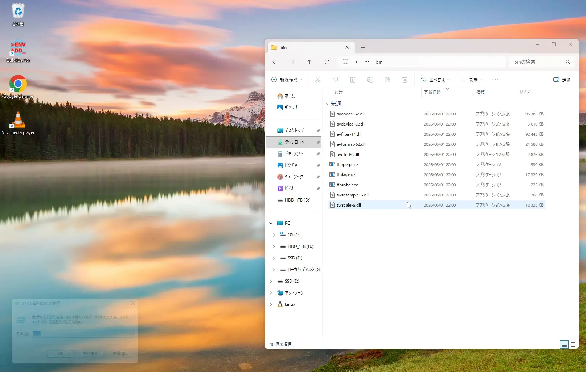
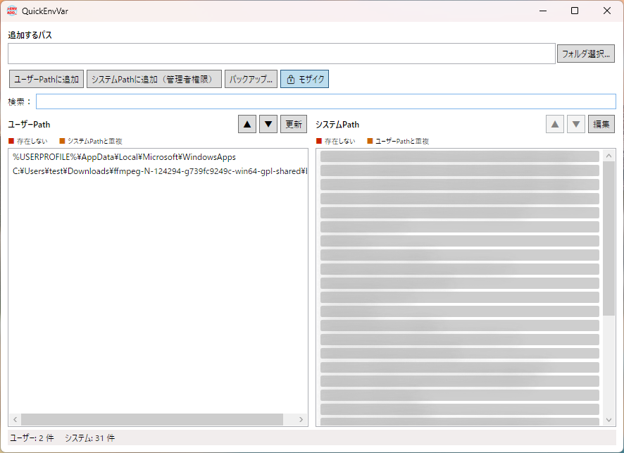
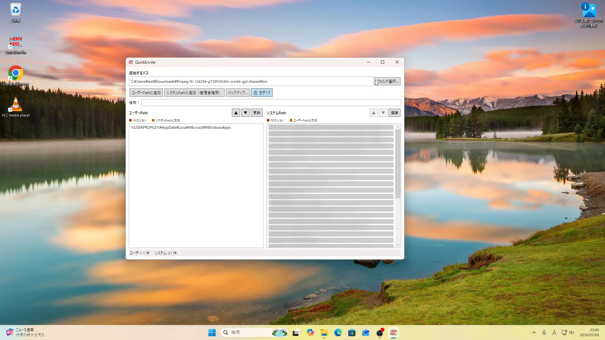
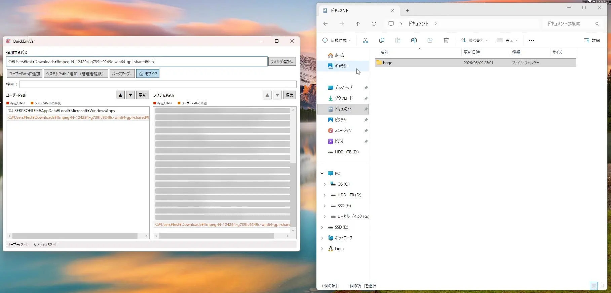

# QuickEnvVar

QuickEnvVar は、Windows の環境変数 `Path` を簡単に閲覧・編集できる WPF アプリケーションです。



## インストール
Releasesからダウンロードしたインストーラーを実行するだけです。
フォルダを右クリックしたときに「QuickEnvVarで開く」という項目を表示するためにレジストリを変更します。インストーラーは管理者権限で実行してください。

## アンインストール
Windows の「インストールされているアプリ」から QuickEnvVar をアンインストールしてください。

もしくは、インストーラーと同じフォルダにある `unins000.exe` を実行してもアンインストールできます。

## 概要



- ユーザー Path とシステム Path をそれぞれ一覧表示
- パスの追加、削除、並べ替えに対応
- システム Path の変更は UAC による昇格で安全に実行
- 存在しないパスを赤表示、ユーザーとシステムで重複するパスをオレンジで表示
- フォルダのドラッグ＆ドロップでパスを入力可能
- Path のバックアップをテキストファイルとしてエクスポート
- リスト項目の右クリックでフォルダを開く、パスをコピー、削除が可能

以下は重複するパスがオレンジで表示される例です。


また、以下は存在しないパスが赤で表示される例です。



## 主な機能

- ユーザー Path の追加/削除/並べ替え
- システム Path の編集モード（変更をまとめて適用）
- 検索フィルタで Path を絞り込み
- フォルダダイアログからの選択、およびファイル/フォルダのドラッグ＆ドロップ
- Path のバックアップエクスポート
- `MainWindow` 起動時にコマンドライン引数としてフォルダパスを渡して初期入力

## 技術スタック

- .NET 10
- WPF
- C#

## ビルドと実行

.NET SDK をインストールしている環境で、以下のコマンドを実行してビルドと実行が可能です。

```powershell
dotnet build
dotnet run
```

## 注意点

- システム Path の変更には管理者権限が必要です。
- システム Path の編集は「編集」ボタンで編集モードを開始し、完了後に「適用（UAC）」で確定します。
- 変更後は ターミナルやVS Codeなどを再起動しないと新しい Path が反映されない場合があります。

## 参考ファイル

- `QuickEnvVar\MainWindow.xaml` - UI レイアウト
- `QuickEnvVar\MainWindow.xaml.cs` - アプリケーションロジック
- `QuickEnvVar\PathEntry.cs` - Path 項目モデル
- `QuickEnvVar\QuickEnvVar.csproj` - プロジェクト設定

## 免責

本アプリは Windows のレジストリを直接操作します。重要な環境変数を変更するため、実行前に必ずバックアップを取ってください。
また、このアプリケーションの使用によるいかなる損害も作者は責任を負いません。

## ライセンス
MIT License